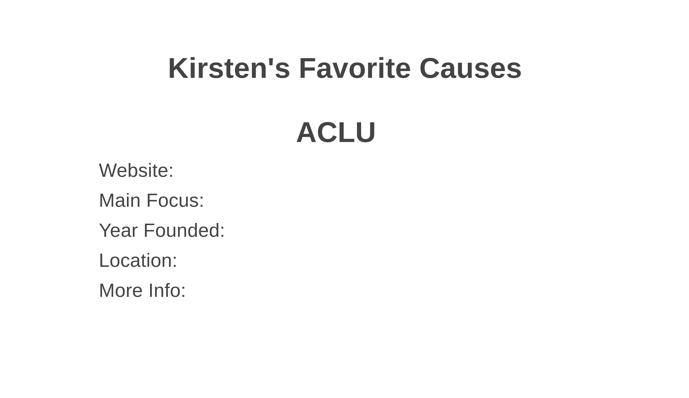

# kirstens-favorite-things
### General Assembly Project 2 - My First Full-Stack App
A site showing some of my favorite things: causes, restaurants, and travel locations. With the option to add, edit, or delete causes suggested for me.
___
### See my deployed site here!
- [Kirsten's Favorite Things](https://afternoon-ocean-90118.herokuapp.com/)
___
### Approach to Building
I started this project with a very bare-bones site because while I knew I wanted to get some of the bigger challenges out of the way earlier, I also knew I needed a decent base to test any new features I wanted to add. I started by making the views for my home page and favorites pages, and the routes to go along with all of those, which felt pretty comfortable. Next came the fun steps of making my model and the routes and views it needs to perform all of it's functions! One of the things that helped me the most while doing these steps (and the whole project) was being able to rewatch the different lectures (or parts of them) as needed. Overall, I felt more confident than I thought I would while doing this project. There are also some little updates I can make as I have time to improve the site and I look forward to completing those (see notes below).
___
### Technologies Used
- HTML
- CSS
- JavaScript
- Node.js
- MongoDB
- MongooseJS
- EJS
- Express
____
### Wireframes
Wireframe for the home page

Wireframe for the page of one specific cause

Wireframe for the page where users can suggest a new cause

___
### MVP User Stories
- As a user, I can view causes site host cares about and see information about each one
- As a user, I can view favorite restaurants of site host and see information about each one
- As a user, I can view favorite travel locations of site host and see information about each one
- As a user, I can view newly suggested causes and see information about each one
- As a user, I can suggest a new cause and provide information about it
- As a user, I can edit a newly suggested cause and the information provided about it
- As a user, I can delete a newly suggested cause and the information provided about it
____
### Notes to self for continuing future work
- You already know the CSS needs work.
- Add pages etc for suggested restaurants and travel locations
- Add more info, pictures, and favorites
- Make About Me page
____
### Unsolved Issues
No technical issues, just some design changes I would like to make, and things I would like to add!

